# 📘 Cyberdeck Survival Manual

**Version:** v1.0 — *Offline Systems Edition (2025)*
**Author:** *EzioDevio*

---

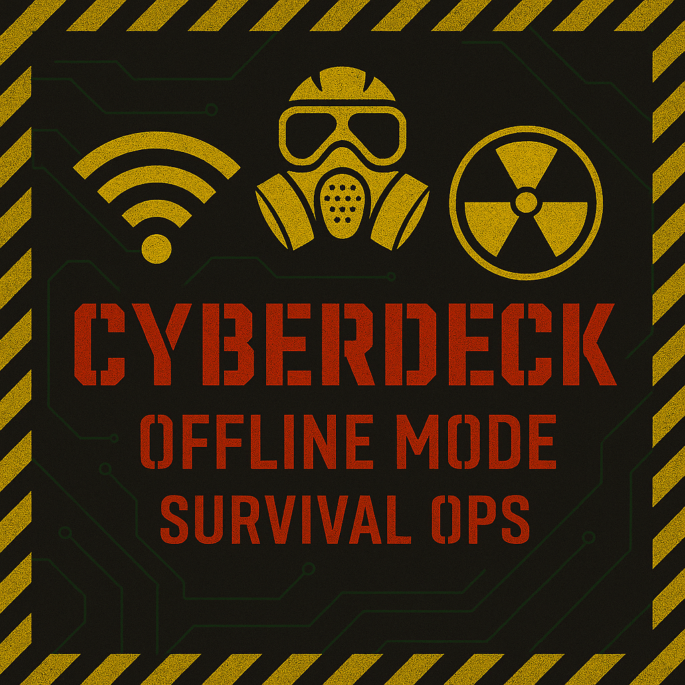

---

## 📑 Table of Contents

1. [Cyberdeck Build Summary](#-cyberdeck-build-summary)
2. [Desktop Interface & Core Tools](#-desktop-interface--core-tools)
3. [Terminal Access & Command Reference](#-terminal-access--command-reference)
4. [Wi-Fi & Hotspot Configuration](#-wi-fi--hotspot-configuration)
5. [Bluetooth Devices](#-bluetooth-devices)
6. [Programming & IDE Tools](#-programming--ide-tools)
7. [Jellyfin (Offline Media Server)](#-jellyfin-offline-media-server)
8. [Kiwix (Offline Wikipedia)](#-kiwix-offline-wikipedia)
9. [Calibre (eBook Library)](#-calibre-ebook-library)
10. [FoxtrotGPS (Offline Navigation)](#-foxtrotgps-offline-navigation)
11. [Ollama / Open WebUI (AI Chatbot)](#-ollama--open-webui-ai-chatbot)
12. [SDR Angel (Radio Analysis)](#-sdr-angel-radio-analysis)
13. [CHIRP (Radio Programming)](#-chirp-radio-programming)
14. [Xfburn (CD/DVD Burner)](#-xfburn-cddvd-burner)
15. [FreeCAD (Engineering CAD)](#-freecad-engineering-cad)
16. [NVMe Storage & File Access](#-nvme-storage--file-access)
17. [Appendix — Commands & Power System Notes](#-appendix--commands--power-system-notes)

---

## 🧠 Cyberdeck Build Summary

**Device:** Raspberry Pi 5 (16 GB)
**Storage:** 2 TB NVMe SSD (Mounted at `/mnt/nvme/`)
**Display:** 10.1″ Waveshare Touch LCD (HDMI + USB)
**Power:** Geekworm X1202 UPS HAT with dual 18650 Li-ion cells
**Enclosure:** Pelican Vault V200 Custom 3D-Printed Panels
**Operating System:** Raspberry Pi OS Desktop (64-bit)
**Primary Use:** Fully offline survival, AI, media, and communication platform

### Key Offline Apps Installed

* **Jellyfin** – Local media server
* **Kiwix** – Offline Wikipedia server
* **Calibre** – eBook library and PDF manager
* **FoxtrotGPS** – Offline navigation
* **Ollama + Open WebUI** – Local AI chat
* **SDR Angel** – Software-defined radio suite
* **CHIRP** – Radio programming
* **Xfburn** – Optical disc utility
* **FreeCAD** – CAD modeling
* **NVMe Data Repo** – Central offline storage

---

## 🖥️ Desktop Interface & Core Tools

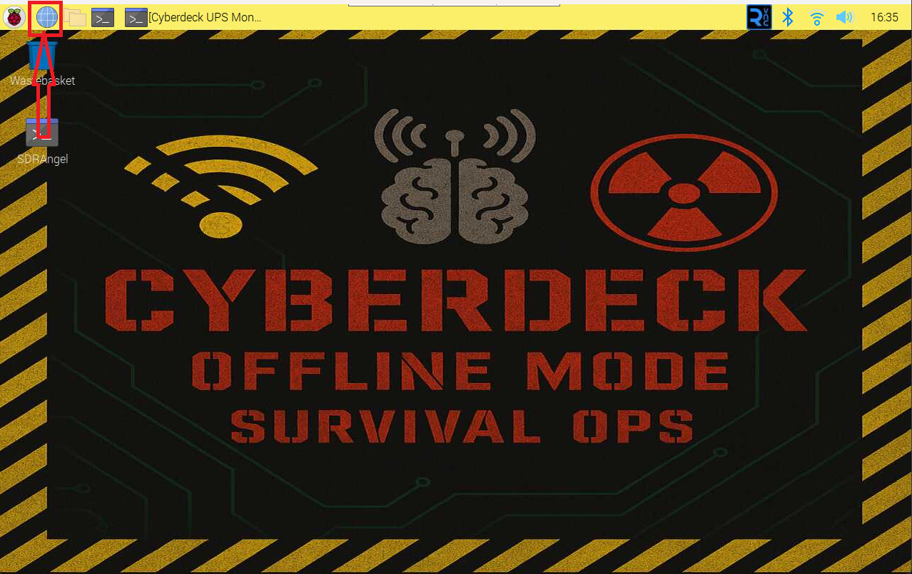
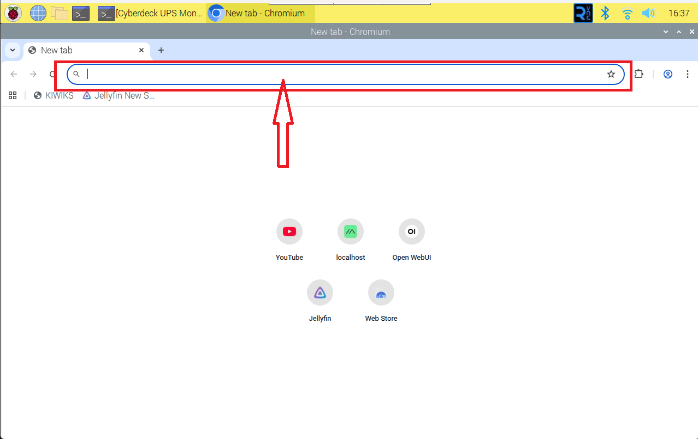

1. **Access Main Menu** → bottom-left 🪟 icon.
2. **Quick-launch panel** hosts icons for Terminal, Web Browser, File Manager, and key apps.
3. System monitor widget shows CPU %, memory, temperature, and battery state.
4. Default user: `ezio` / home directory `/home/ezio`.
5. Main storage path: `/mnt/nvme/`.

---

## 🖳 Terminal Access & Command Reference

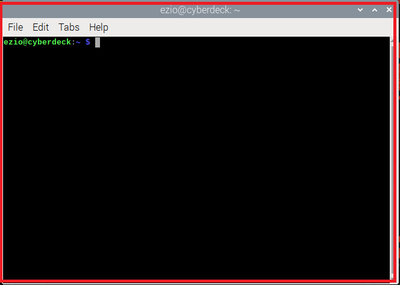

Open from menu or press **Ctrl + Alt + T**.

| Command                 | Description            |
| :---------------------- | :--------------------- |
| `ls`                    | List files             |
| `cd`                    | Change directory       |
| `sudo apt update`       | Update system packages |
| `df -h`                 | Check disk space       |
| `free -h`               | Show memory use        |
| `vcgencmd measure_temp` | CPU temperature        |
| `shutdown -h now`       | Power off              |
| `sudo reboot`           | Restart                |

💡 *All standard Bash and apt commands function offline if packages are cached.*

---

## 🌐 Wi-Fi & Hotspot Configuration

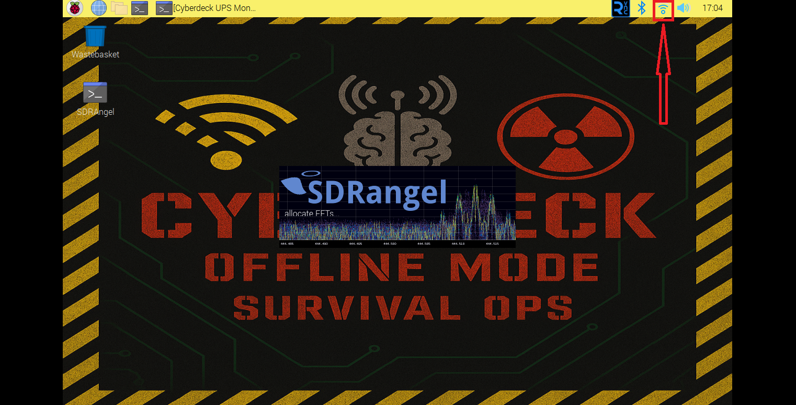
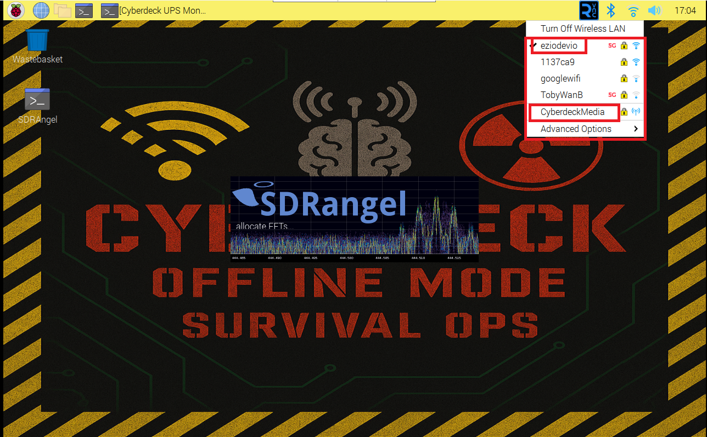

### Connect to Wi-Fi

Click the 🔹 Wi-Fi icon → select network → enter password.

### Create Hotspot

1. **Menu → Preferences → Advanced Network Config**
2. Add new connection → **Wi-Fi → Mode = Hotspot**
3. SSID `CyberdeckMedia`
4. Security WPA2 – Password `offlineops`
5. Set IP `10.42.0.1`

Clients can now connect directly for Jellyfin or Kiwix access.

---

## 🔵 Bluetooth Devices

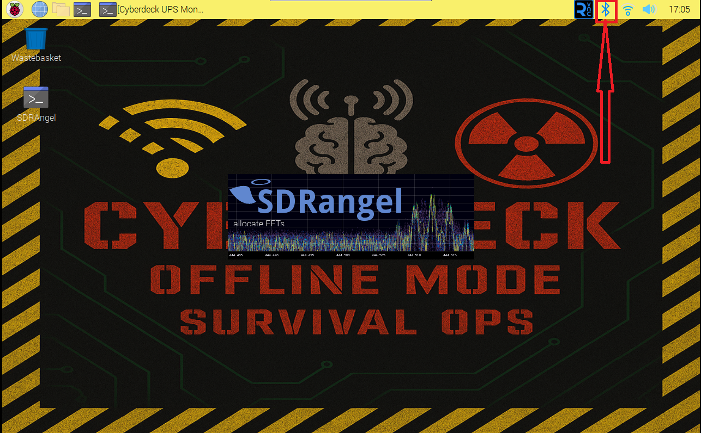
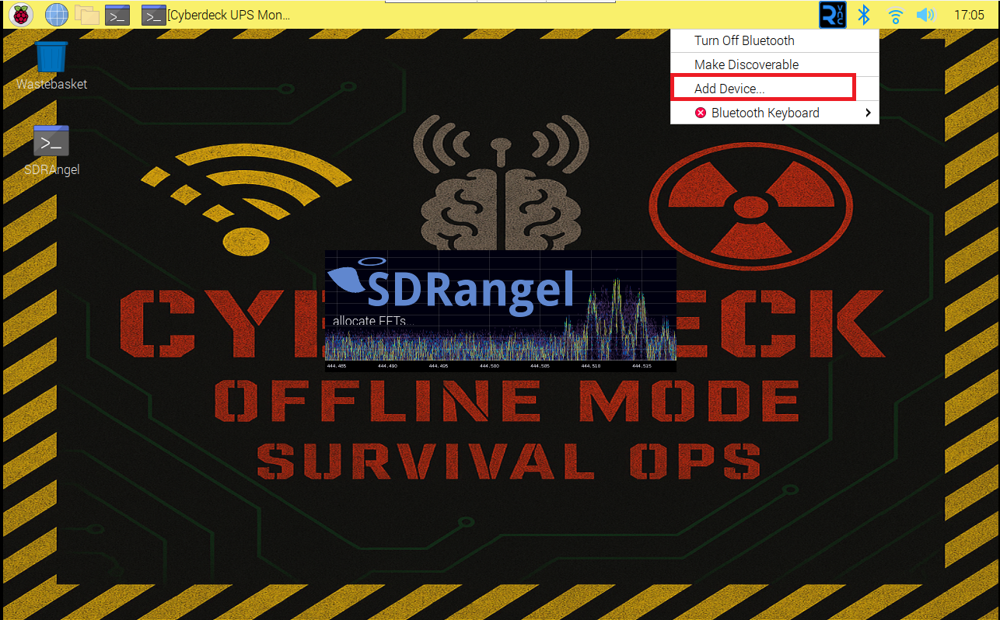

1. Click Bluetooth icon → **Add Device**.
2. Select headphones, controller, or phone.
3. Approve pairing.
4. Connected devices appear in list.
5. Right-click → Connect / Remove / Properties.

*Bluetooth shares small files and audio; range ≈ 10 m.*

---

## 💻 Programming & IDE Tools

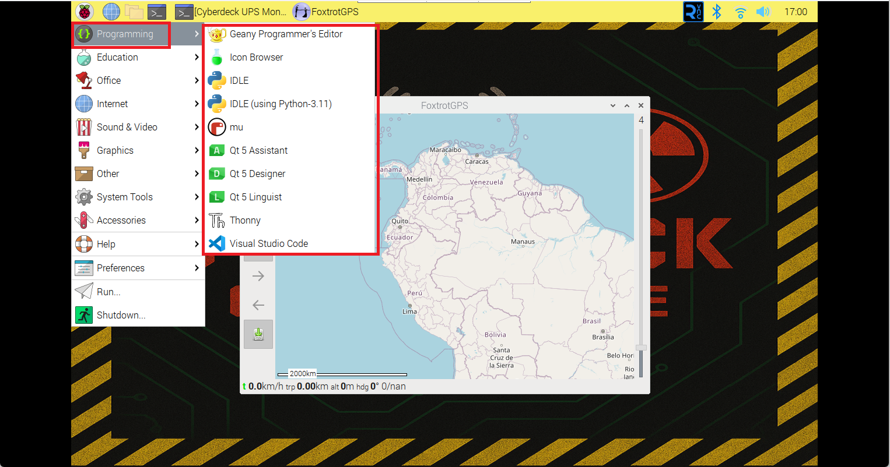

Installed development environments:

* **Thonny** – Python IDE
* **Geany** – Lightweight C/Python/HTML
* **Arduino IDE** – Microcontroller sketches
* **VS Code (offline)** – Full editor
* **Git** – Version control

All located under **Main Menu → Programming**.
Projects stored in `/mnt/nvme/projects/`.

---

## 🎬 Jellyfin (Offline Media Server)

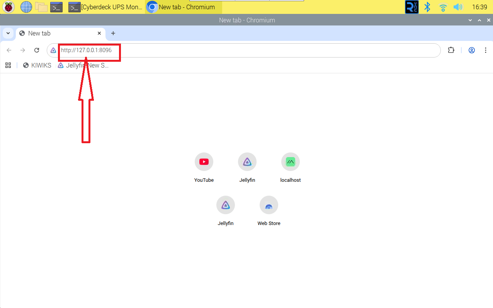

1. Launch from Main Menu → Internet → Jellyfin.
2. Access in browser:

   ```
   http://10.42.0.1:8096
   ```
3. Media library paths:

   * `/mnt/nvme/media/movies/`
   * `/mnt/nvme/media/music/`
   * `/mnt/nvme/media/series/`
4. User login: `admin / offlineops`.
5. Streams locally to any connected device.

---

## 📚 Kiwix (Offline Wikipedia)

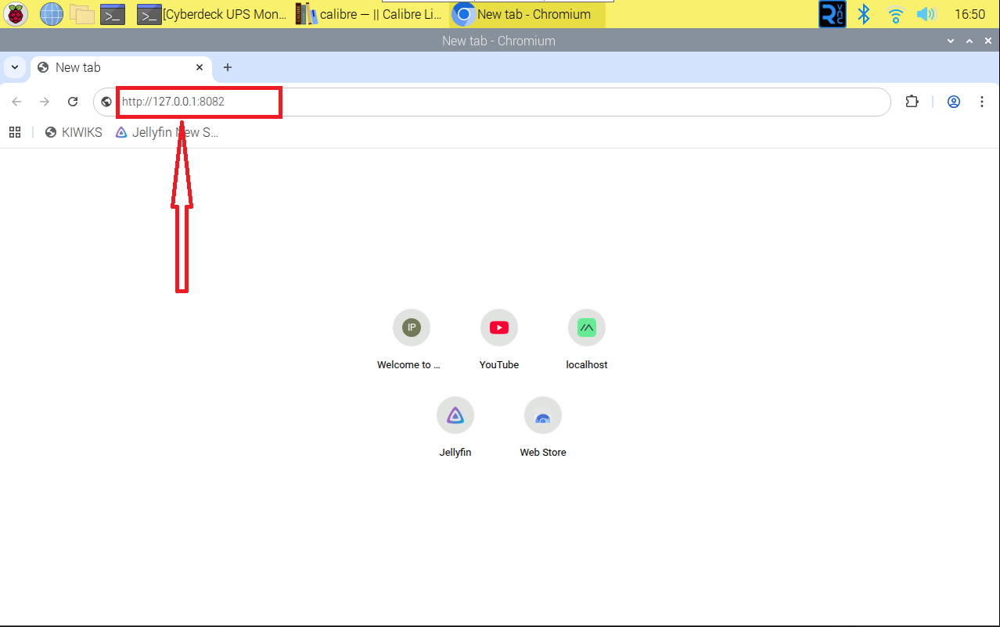

1. Launch **Main Menu → Internet → Kiwix Server**.
2. Access via browser:

   ```
   http://10.42.0.1:8080
   ```
3. ZIM files stored in `/mnt/nvme/wiki/`.
4. Use search bar to browse offline articles.

💡 *Add additional ZIM archives anytime; no Internet required.*

---

## 📖 Calibre (eBook Library)

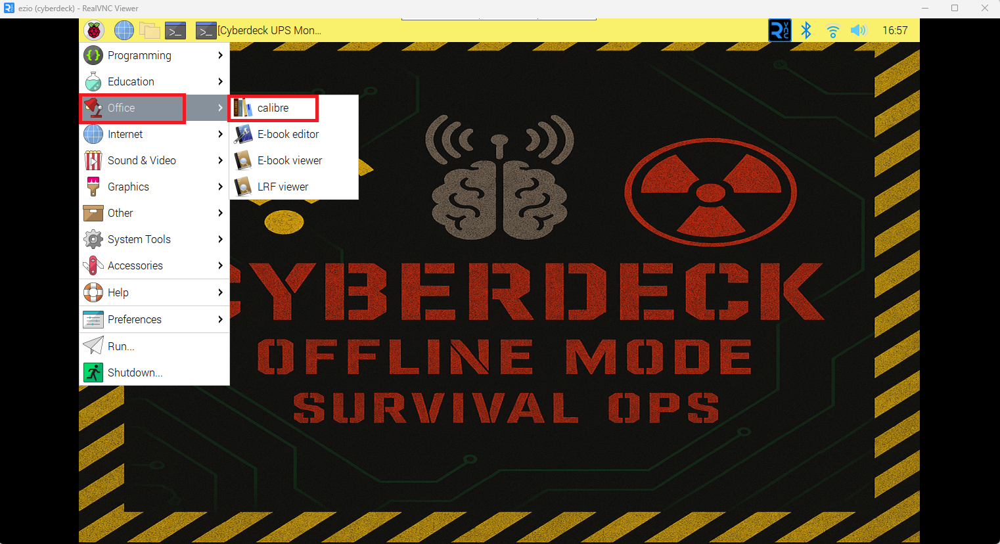

1. Launch **Main Menu → Office → Calibre**.
2. Library path `/mnt/nvme/calibre_library/`.
3. Add books → “Add Books” button.
4. View with eye icon.
5. Convert formats via “Convert Books”.
6. Backup library to USB drive.

---

## 🗺️ FoxtrotGPS (Offline Navigation)

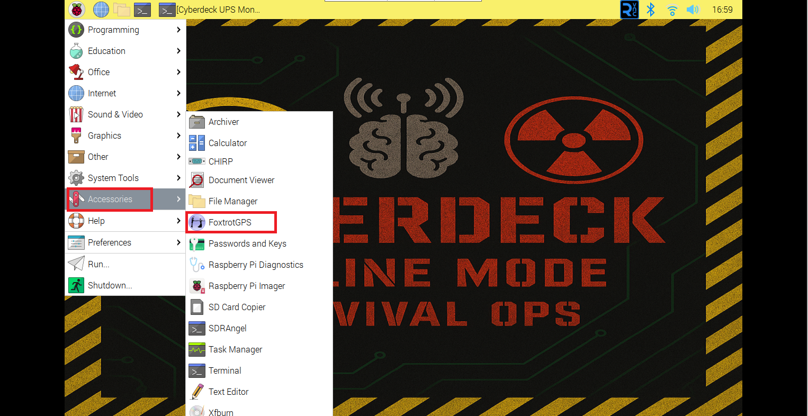

1. Launch **Main Menu → Navigation → FoxtrotGPS**.
2. Map tiles stored in `/mnt/nvme/maps/`.
3. GPS device usually `/dev/ttyUSB0`.
4. Configure → Enable GPS → 9600 baud.
5. Record tracks to `/mnt/nvme/maps/tracks/`.

---

## 🧠 Ollama / Open WebUI (AI Chatbot)

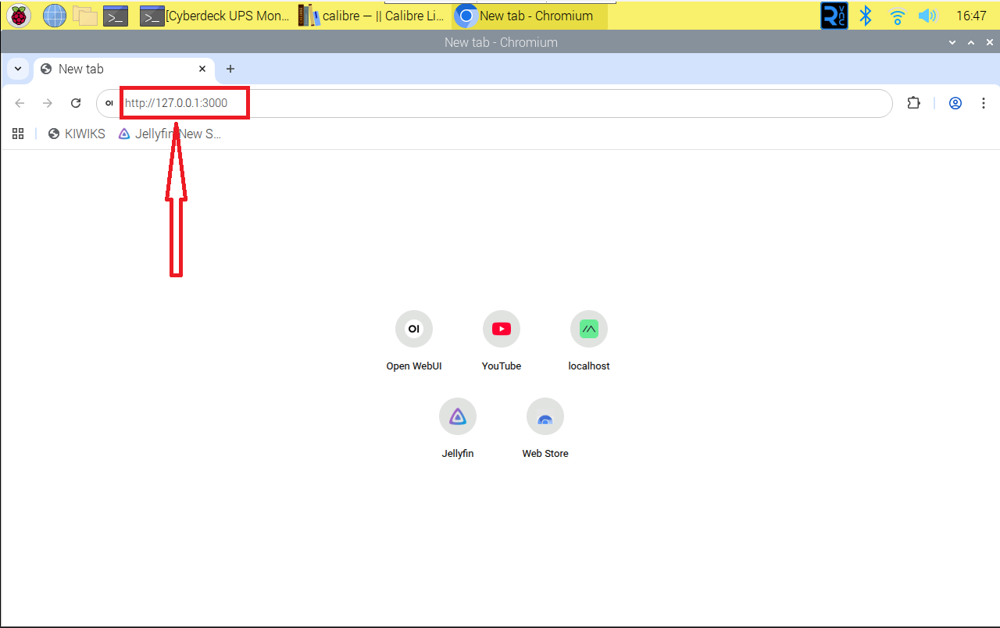

1. Start backend:

   ```bash
   ollama serve
   ```
2. Access interface:

   ```
   http://10.42.0.1:8080
   ```
3. List models: `ollama list`.
4. Models stored under `/usr/share/ollama/models/`.
5. Restart services: `sudo systemctl restart ollama openwebui`.

---

## 📡 SDR Angel (Radio Analysis)

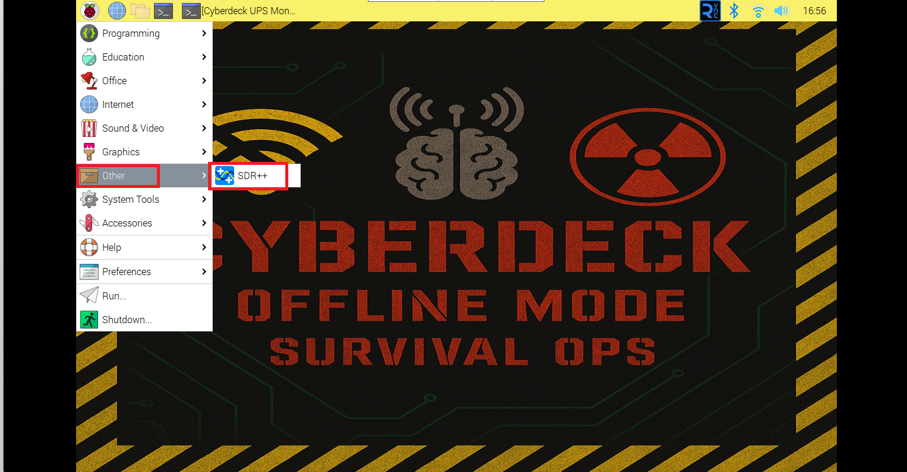

> ⚡ Plug the **RTL-SDR Blog V4** dongle into a USB 3.0 port before launch.

1. Launch **Main Menu → Internet → SDR Angel**.
2. Detect device via `lsusb | grep RTL`.
3. Analyze spectrum (88 MHz–1.7 GHz).
4. Record IQ/WAV data to `/mnt/nvme/radio/`.
5. Use plugins for ADS-B, NOAA, AIS.

---

## 📻 CHIRP (Radio Programming)

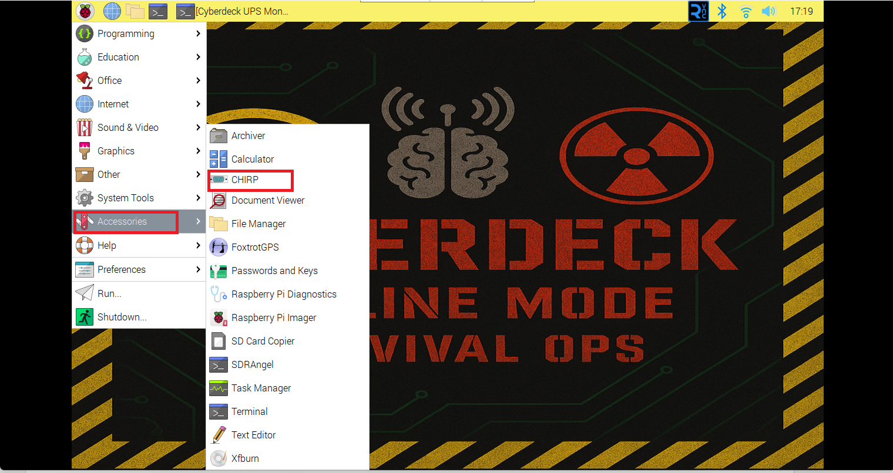

1. Connect Baofeng radio → USB cable.
2. Identify port: `ls /dev/ttyUSB*` → `/dev/ttyUSB0`.
3. **Radio → Download From Radio**.
4. Edit channels, tones, names.
5. **Radio → Upload To Radio**.
6. Save config to `/mnt/nvme/radio_configs/`.

---

## 💿 Xfburn (CD/DVD Burner)

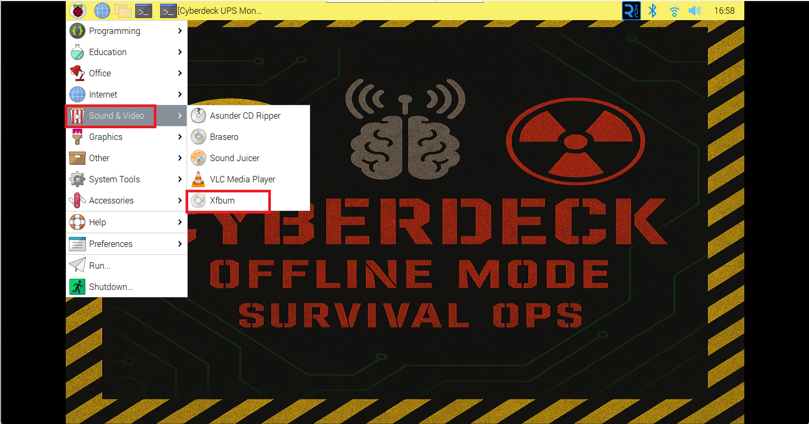

1. Launch **Main Menu → Multimedia → Xfburn**.
2. Insert blank disc → detected as `/dev/sr0`.
3. Burn ISO image or data composition.
4. Verify data after burn for integrity.

---

## 🧱 FreeCAD (Engineering CAD)

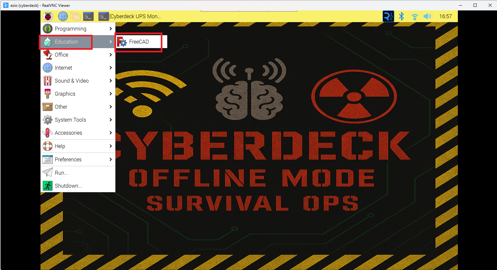

1. Launch **Main Menu → Graphics → FreeCAD**.
2. Create new sketch → Pad to 3D.
3. Save as `.FCStd` in `/mnt/nvme/3d_models/`.
4. Export as `.STL` for printing.
5. Workbenches: Part Design, Sketcher, Mesh, Path.

---

## 💾 NVMe Storage & File Access

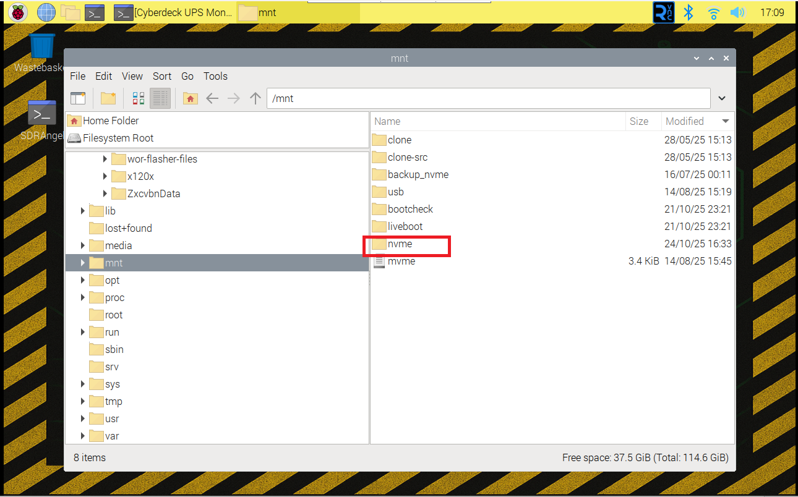

1. NVMe mounted at `/mnt/nvme/`.
2. Folders include `media`, `books`, `wiki`, `maps`, `radio`, `projects`, `models`.
3. Manual mount if missing:

   ```bash
   sudo mount /dev/nvme0n1p1 /mnt/nvme
   ```
4. Backup via `rsync -av /mnt/nvme/ /media/usb/backup/`.
5. Check space with `df -h /mnt/nvme`.

---

## ⚙️ Appendix — Commands, Power System Notes & Maintenance

### Core Commands

`df -h`, `free -h`, `lsusb`, `systemctl status`, `vcgencmd measure_temp`, `sudo shutdown -h now`

### Power Architecture

* Geekworm X1202 UPS HAT (dual 18650 cells)
* I²C Fuel Gauge (0x36) + Conky monitor
* Auto switching AC ↔ Battery

| LED       | State              |
| :-------- | :----------------- |
| Green     | AC Power Connected |
| Yellow    | Battery Mode       |
| Red Blink | Low Voltage        |
| Blue      | Full Charge        |

**Restart Monitor:**

```bash
pkill conky && DISPLAY=:0 conky -c ~/.conkyrc &
```

### Routine Maintenance

| Task          | Frequency | Command                                     |
| :------------ | :-------- | :------------------------------------------ |
| Backup NVMe   | Weekly    | `rsync -av /mnt/nvme/ /media/usb/backup/`   |
| Battery Check | Weekly    | `python3 /usr/local/bin/battery_monitor.py` |
| Clean System  | Monthly   | `sudo apt autoremove && sudo apt clean`     |
| Test Hotspot  | Monthly   | Verify SSID CyberdeckMedia                  |

### Emergency Startup

1. Connect external 5 V supply.
2. Insert bootable SD.
3. Hold power toggle 3 s.
4. Re-mount NVMe → restore from backup.

---

## 🧭 Final Notes

> “**CYBERDECK OFFLINE MODE SURVIVAL OPS**”
> is not just a computer — it’s a **self-reliant intelligence terminal** built to operate beyond networks, enabling survival, knowledge, and autonomy anywhere.

**Print Recommendation:** A4 / Letter – 300 dpi – Monochrome Friendly

---

**END OF MANUAL**
© 2025 EzioDevio — All Rights Reserved

---


